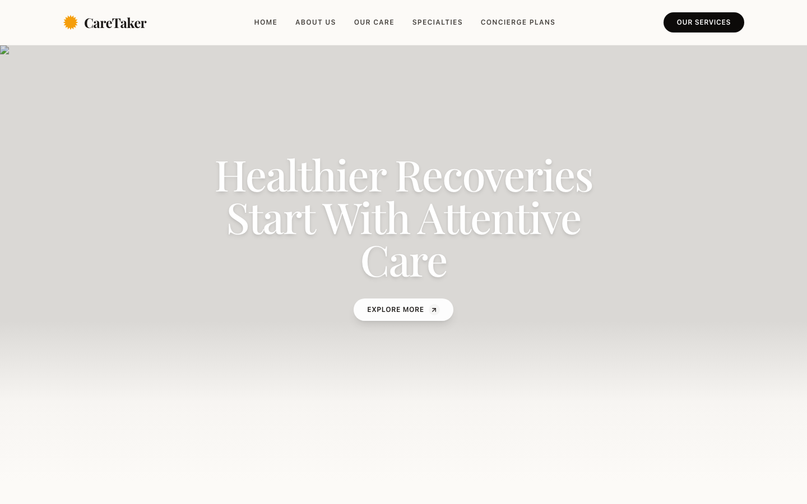
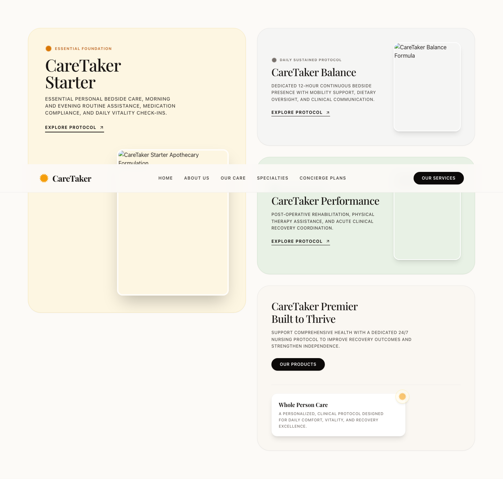

# CareTaker

A modern healthcare web application for booking vetted hospital bedside attendants, nursing scholars, and post-operative home recovery services.

[](https://nodejs.org/)
[](https://nextjs.org/)
[](https://react.dev/)
[](https://tailwindcss.com/)
[](LICENSE)

---

## Live Links

* **GitHub Pages:** [https://ghost-9.github.io/caretaker/](https://ghost-9.github.io/caretaker/)
* **Vercel:** [https://caretaker-nine.vercel.app](https://caretaker-nine.vercel.app)

---

## Screenshots

<p align="center">
  
  &nbsp;
  
</p>

---

## Overview

CareTaker connects families with verified, non-clinical bedside attendants and convalescence assistants when family members cannot be present at the hospital or during home recovery.

The web app is built with Next.js 15 (App Router), React 19, and Tailwind CSS. It features an editorial aesthetic with warm neutrals, responsive bento card layouts, and an intake form that coordinates directly with hospital dispatchers.

### Key Highlights
* **Editorial Layout:** Clean typography, soft earth tones, and responsive bento cards presenting care tiers clearly.
* **Care Tiers:** 4 structured service protocols (Starter, Balance, Performance, and Premier 24/7 care).
* **Direct Intake Form:** Validated client-side booking intake that routes patient requirements directly to coordinators.
* **Dual Deployment Pipeline:** Pre-configured for both Vercel serverless deployments and static export to GitHub Pages.

---

## Project Structure

```
caretaker/
├── app/
│   ├── globals.css              # Global tokens, typography, and styling
│   ├── layout.tsx               # Root document layout and SEO metadata
│   └── page.tsx                 # Main landing page
├── components/
│   ├── Header.js                # Top navigation and mobile drawer
│   ├── HeroSection.js           # Hero banner with soft gradient fade
│   ├── EditorialHeadlineSection.js # Editorial headline with inline imagery
│   ├── BentoShowcaseSection.js  # Care plan cards (Starter, Balance, etc.)
│   ├── FormSection.js           # Patient intake consultation form
│   ├── Footer.js                # Site footer, legal notes, contact details
│   └── StarburstIcon.js         # Vector emblem
├── pages/
│   ├── admin.js                 # Admin intake overview portal
│   └── api/
│       ├── book.js              # Booking handler (webhooks / spreadsheet sync)
│       └── googlesheets.js      # Sheets integration
└── docs/
    └── screenshots/             # Production screenshots
```

---

## Getting Started

### Prerequisites
* Node.js 24.x (recommended) or 20.x+
* npm, pnpm, or yarn

### Installation
```bash
git clone https://github.com/Ghost-9/caretaker.git
cd caretaker
npm install
```

### Development
```bash
npm run dev
```
Open [http://localhost:3000](http://localhost:3000) to view the site in your browser.

### Production Build
```bash
# Standard Vercel / server build
npm run build

# Static export (for GitHub Pages)
DEPLOY_TARGET=gh-pages npm run build
```

---

## License

This project is licensed under the [MIT License](LICENSE).
